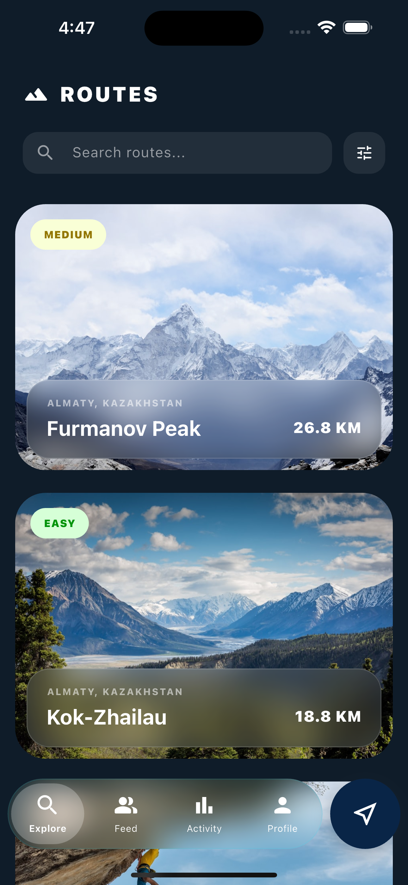
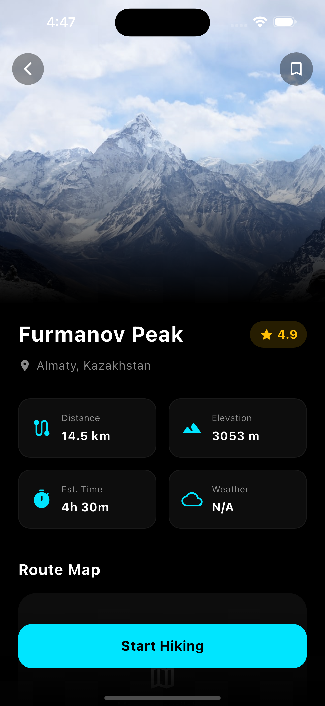
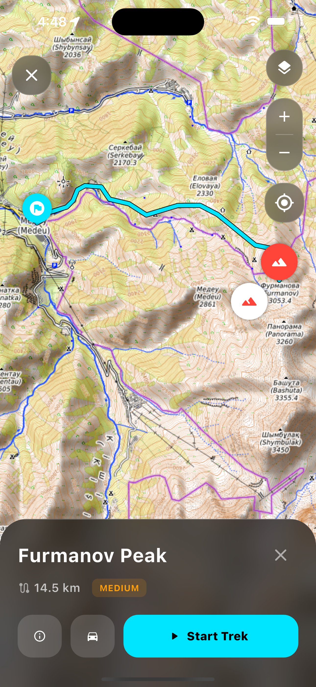
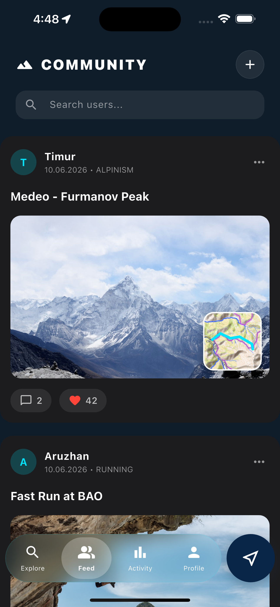
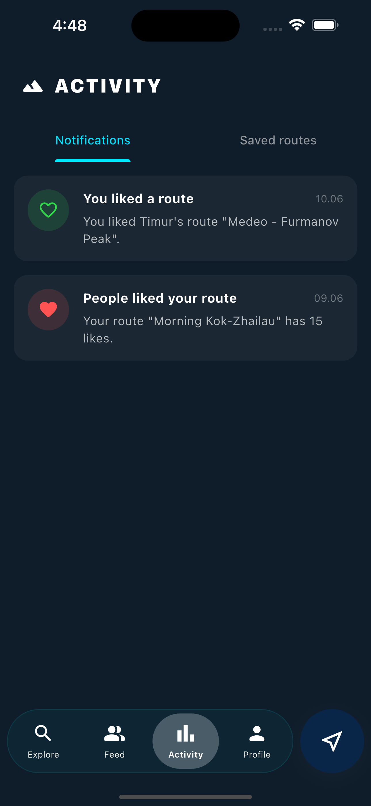
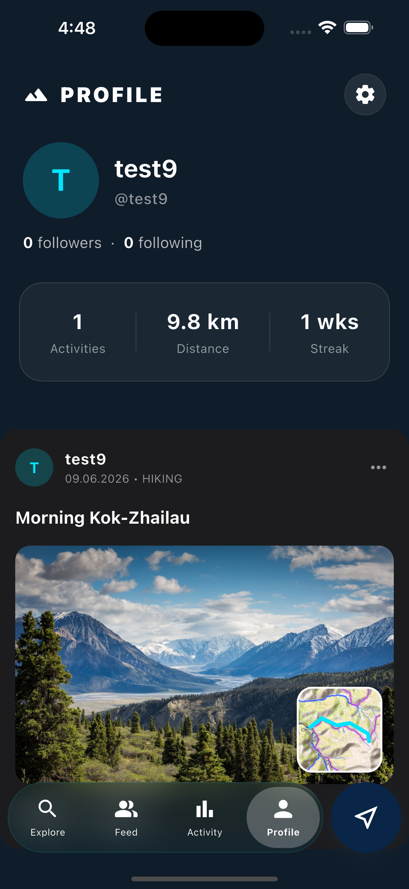

# 🏔️ SHYN - Premium Hiking & Tracking App

SHYN is a full-stack mobile platform designed specifically for hikers and outdoor enthusiasts in Kazakhstan (Almaty region). It provides users with a complete toolset for route discovery, real-time GPS tracking, offline navigation, and community interaction.

## ✨ Key Features

* **🗺️ Curated Route Catalog:** Discover popular local trails (Furmanov Peak, Kok-Zhailau, Bukreev Peak, etc.) with detailed descriptions, difficulty levels, and elevation data.
* **📍 Real-Time GPS Tracking:** Track your hikes with live updates on distance, time, and pace.
* **📡 Offline Maps & GPX:** Download specific regions (e.g., Almaty Mountains) and GPX tracks to navigate safely without internet coverage.
* **🌐 Interactive Map Layers:** Switch between Topographic and Satellite views using `flutter_map` and OpenTopoMap.
* **👥 Community Feed:** Share your completed tracks, photos, and achievements. Like and comment on other hikers' activities.
* **👤 User Profile & Statistics:** Track your total distance, number of activities, and weekly hiking streaks.

## 📱 Screenshots

| Onboarding & Login | Route Details | Map & Live Tracking |
| :---: | :---: | :---: |
|  |  |  |

| Community Feed | Liked Routes | User Profile |
| :---: | :---: | :---: |
|  |  |  |

## 🛠️ Tech Stack

### Mobile App (Frontend)
* **Framework:** Flutter (Dart)
* **State Management:** Provider
* **Maps & Location:** `flutter_map`, `latlong2`, `geolocator`
* **Network & API:** `dio`
* **Local Storage & Caching:** `shared_preferences`, `hive`, `flutter_cache_manager`
* **UI/UX:** Glassmorphism design, custom animations, `go_router` for navigation.

### Backend Infrastructure
* **Deployment:** AWS EC2, Docker
* **Storage:** MinIO (for GPX files and photos)
* **Caching:** Redis
* **Security & Auth:** JWT, Google OAuth2

## 🚀 Getting Started

### Prerequisites
* Flutter SDK (>=3.0.0)
* Xcode (for iOS) or Android Studio (for Android)
* CocoaPods (for iOS dependencies)
